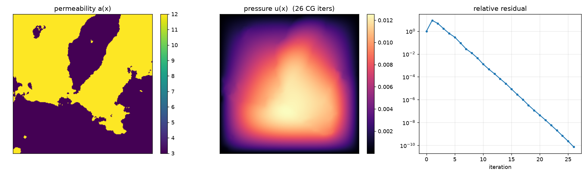
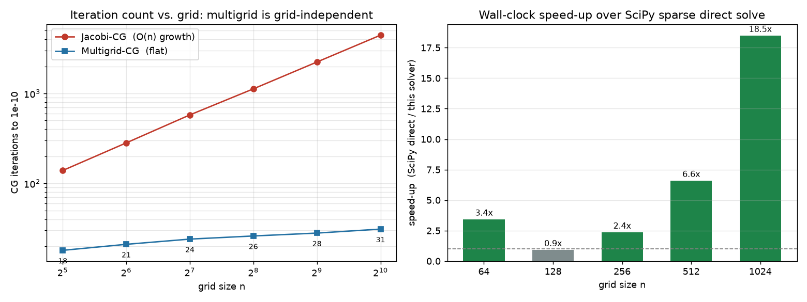

# darcy-cpp

A **matrix-free, multigrid-preconditioned** finite-volume solver for 2D
**Darcy flow**: given a random permeability field `a(x)`, it solves the PDE
`-div(a grad u) = f` for the pressure `u(x)`. Written in **C++17**, parallelised
with **OpenMP**, and exposed to Python via **pybind11** with zero-copy NumPy
access — the 5-point stencil is applied on the fly, so no sparse matrix is ever
assembled.

Why this problem: a naive iterative solver for this elliptic PDE is easy to
write and *does not scale* — the operator's condition number grows like `O(n²)`,
so plain Conjugate Gradient needs `O(n)` iterations and the cost per solve
explodes with resolution. The engineering here is fixing that with a **geometric
multigrid preconditioner**, which makes the iteration count essentially
grid-independent, and doing it matrix-free so memory stays `O(N)`. It is also
the C++ ground-truth generator for the training data in
[fno-darcy-flow](https://github.com/AbdullahRasheed45/fno-darcy-flow) — the two
implementations cross-validate to `1e-12`.



## Quickstart

```bash
pip install .                 # C++17 compiler + pybind11 (pulled in automatically)
# macOS: brew install libomp   first, for the OpenMP-parallel build

python examples/quickstart.py  # a five-minute tour of the API
```

```python
import numpy as np
import darcy

# Sample the standard two-phase benchmark medium (thresholded Gaussian field).
a = darcy.two_phase_permeability(darcy.gaussian_random_field(512, seed=0))

# Solve. Returns a dataclass with diagnostics, not a bare array.
result = darcy.solve(a, f=1.0, tol=1e-10)
result.u            # (512, 512) pressure field
result.iterations   # 28 — grid-independent, thanks to multigrid
result.converged    # a max_iter miss is reported here, never raised
result.levels       # 10 multigrid levels

# Generate a training batch, parallel across samples with the GIL released.
batch_a = np.stack([
    darcy.two_phase_permeability(darcy.gaussian_random_field(64, seed=s))
    for s in range(1000)
])
batch = darcy.solve_batch(batch_a, tol=1e-10)   # ~2,300 solves/s on 10 threads
```

Or from the command line:

```bash
darcy solve   --grid 512 --seed 0                            # solve one problem
darcy dataset --n-samples 1000 --grid 64 -o data/train.npz   # parallel dataset generation
darcy bench   --grids 64 128 256 512 1024                    # benchmark vs SciPy
darcy info                                                   # build / threading details
```

## Benchmarks

Reproduce with `darcy bench`. Numbers below are from an Apple M-series laptop,
10 OpenMP threads, against `scipy.sparse.linalg.spsolve` (SuperLU direct) —
rerun on your hardware, the absolute times vary but the scaling does not.



| grid | unknowns | CG iters | levels | this solver (ms) | SciPy direct (ms) | speed-up | rel. err |
|------|----------|----------|--------|------------------|-------------------|----------|----------|
| 64   | 4 096    | 21 | 7  | 14.5  | 48.3     | 3.3×  | 7.7e-13 |
| 128  | 16 384   | 24 | 8  | 34.3  | 31.6     | 0.9×  | 7.6e-13 |
| 256  | 65 536   | 26 | 9  | 77.8  | 170.5    | 2.2×  | 5.6e-13 |
| 512  | 262 144  | 28 | 10 | 193.2 | 1 240.7  | 6.4×  | 1.3e-12 |
| 1024 | 1 048 576| 31 | 11 | 627.7 | 10 408.1 | **16.6×** | 4.4e-12 |

The multigrid claim, made concrete — CG iterations to reach `1e-10`, versus the
Jacobi baseline the previous version used:

| grid | 64 | 128 | 256 | 512 | 1024 |
|------|----|-----|-----|-----|------|
| Jacobi-CG | 282 | 577 | 1125 | 2237 | 4448 |
| **Multigrid-CG** | **21** | **24** | **26** | **28** | **31** |

Jacobi's count roughly doubles with each grid doubling — the `O(n)` growth the
theory predicts. The multigrid count stays flat. That flat row is the whole
point.

## Design decisions (and why)

The questions a reviewer will ask, answered:

- **Why multigrid, and why does it make CG grid-independent?** The discrete
  elliptic operator has condition number `O(n²)`, so CG needs `O(√κ) = O(n)`
  iterations, and diagonal (Jacobi) preconditioning does nothing about the
  spread. Multigrid attacks the cause: the smoother kills high-frequency error
  fast but stalls on smooth error, and smooth error is exactly what a coarser
  grid represents well. Recursing across a hierarchy gives a preconditioner
  whose quality doesn't degrade with `n` — 21 → 31 iterations across a 16×
  refinement, versus Jacobi's 282 → 4448.

- **Why matrix-free instead of assembling the matrix?** Storage stays `O(N)`
  with no index arrays, and every kernel is a unit-stride streaming loop that
  vectorises and parallelises trivially. A direct factorisation suffers fill-in
  — its factors are far denser than the operator — which is why SciPy's `spsolve`
  falls off a cliff at 1024² and becomes untenable in 3D. The trade is that you
  must iterate, which is exactly why the preconditioner earns its keep.

- **Why harmonic averaging of permeability at cell faces?** The permeability is
  piecewise-constant (two-phase media), so it's *discontinuous* at phase
  boundaries. The **harmonic** mean `2 a_i a_j / (a_i + a_j)` is the exact 1D
  flux for a piecewise-constant coefficient, so it preserves flux continuity
  across a jump; the arithmetic mean does not and loses an order of accuracy.
  This is the standard finite-volume treatment for discontinuous coefficients,
  and it holds up at a 10⁶ permeability contrast.

- **Why Conjugate Gradient?** The finite-volume operator is symmetric positive
  definite, so CG is the natural Krylov method: it minimises the error in the
  `A`-norm with a three-term recurrence and only a constant number of stored
  vectors (unlike GMRES). The residual isn't monotone in the 2-norm — the first
  preconditioned step raises it as the preconditioner rescales — but it is
  monotone in the `A`-norm, which is why the convergence plot bumps once then
  falls in a straight line.

- **Why is the coarsening cheap *and* correct?** Coarse levels are built by 2×2
  agglomeration. Summing the fine face coefficients reproduces the Galerkin
  product `PᵀAP` **exactly** — proved in the header of `level.hpp`, checked
  entry-by-entry against dense reference matrices in the C++ tests — so the work
  is `O(N)` with no sparse triple product, yet every coarse operator stays SPD.
  The same summation handles odd grid sizes (the trailing aggregate has width
  one), so power-of-two grids are not required.

- **Why keep the cycle symmetric / why a W-cycle by default?** CG requires an
  SPD preconditioner, and a multigrid cycle is SPD only if it's symmetric —
  pre- and post-smoothing must be transposes (red-then-black going down,
  black-then-red coming up). Swap the post-smoothing colours and the
  preconditioner-symmetry test fails immediately while the solver still *appears*
  to work. Piecewise-constant aggregation gives a weaker coarse correction than
  smoothed interpolation, so a V-cycle's count still creeps up with `n`; the
  W-cycle compensates and stays flat, and because coarse levels are tiny it wins
  on wall-clock too.

- **Why red-black Gauss-Seidel as the smoother?** Gauss-Seidel is normally
  inherently sequential. Red-black ordering makes it embarrassingly parallel —
  same-colour cells depend only on the other colour, so a whole colour updates
  concurrently — and the result is bit-identical regardless of thread count,
  which the batch determinism test asserts directly.

- **Why parallelise across samples, not within a single solve?** The stencil and
  BLAS-1 kernels do `O(1)` flops per byte moved, so a single solve is
  memory-bandwidth-bound and saturates the memory controllers at ~1.2× on 4
  threads — a property of the problem, not a bug. `solve_batch` therefore
  parallelises over independent samples, where each thread keeps its own working
  set hot and throughput reaches ~2,300 64² solves/s. (A profiling lesson lives
  here too: naively opening an OpenMP region on tiny coarse levels made the
  W-cycle 30× slower than its flop count predicts; a serial fallback below ~4096
  cells cut wall-clock ~4×.)

- **Why validate against a direct solver rather than trust convergence?**
  "It converged" is not "it's right". The SciPy reference assembles the operator
  and solves it by direct factorisation — a different algorithm built from a
  different representation — so agreement to `1e-12` is real cross-validation,
  not two copies of the same mistake.

Full write-up in [docs/design.md](docs/design.md).

## Tests

```bash
pip install -e '.[dev]'
python -m pytest -q                                  # 98 Python tests

cmake -S . -B build -DDARCY_BUILD_TESTS=ON            # native C++ tests:
cmake --build build && ctest --test-dir build         #   Galerkin identity, SPD-ness, symmetry
```

- **Correctness** (`test_correctness.py`): agreement with SciPy's sparse direct
  solve on random media (including odd grids and a 10⁶ contrast), plus analytic
  invariants — operator symmetry and positive-definiteness, the maximum
  principle, linearity in `f`, inverse scaling in `a`, and an honest residual
  recomputed from scratch.
- **Multigrid** (`test_multigrid.py`): the load-bearing regressions — grid-independent
  iteration count, preconditioner symmetry and SPD-ness, logarithmic hierarchy
  depth, and a steadily-contracting residual history.
- **API** (`test_api.py`): input handling (float32, Fortran order, non-contiguous
  views, lists), precise `ValueError`s on bad input, batch determinism across
  thread counts, and introspection.
- **CLI** (`test_cli.py`): the `solve` / `dataset` / `info` subcommands end to end.
- **Native** (`tests/cpp/test_core.cpp`): dependency-free C++ suite checking the
  Galerkin coarsening identity and `R = Pᵀ` adjointness against dense reference
  matrices.

CI runs the Python suite on Linux/macOS/Windows × Python 3.9/3.12, the native
C++ tests, an ASan/UBSan build, and `ruff` + `mypy` on every push.

## Layout

```
include/darcy/config.hpp     # OpenMP shims, restrict/index types
include/darcy/blas.hpp       # parallel BLAS-1 kernels (dot, axpy, fused CG update)
include/darcy/level.hpp      # one grid level: the 5-point SPD operator + red-black GS smoother
include/darcy/multigrid.hpp  # the V/W-cycle preconditioner and its hierarchy
include/darcy/solver.hpp     # preconditioned CG driver + public API and input validation
src/bindings.cpp             # pybind11: zero-copy NumPy, GIL release, typed exceptions
python/darcy/                # typed package, CLI, field generators, SciPy reference
benchmarks/bench.py          # timing vs scipy.sparse spsolve + thread scaling
examples/                    # quickstart tour and the figure-rendering script
tests/                       # 98 Python tests + a native C++ suite
docs/design.md               # the numerical and engineering rationale, in depth
```

## License

MIT — see [LICENSE](LICENSE).
